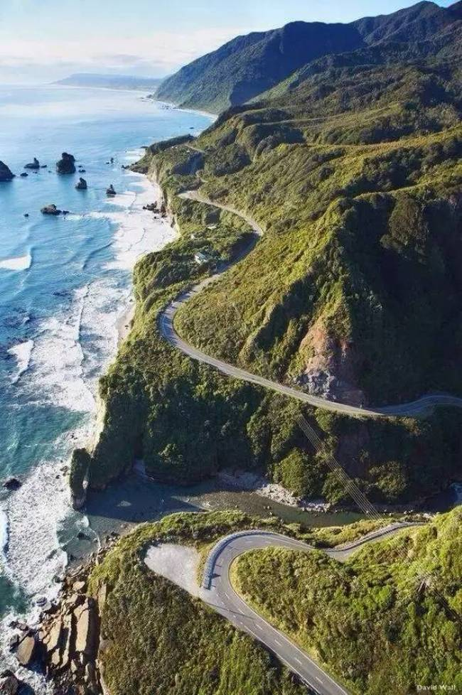

.. _tesaro:

吃喝玩乐
==========

美帝Road Trip十大经典路线大盘点
-------------------------------

作者：芝士旅行 来源：芝士旅行 公众号

享受一星期的自驾旅途，体验全新的旅行方式，这种旅行只有在美国可以体验。美国公路自驾旅行是众多旅行爱好者的首选之旅，在这里将给你一种全新的视觉与心境之旅，为你推荐美国最佳的旅行路线。

66号公路：芝加哥(Chicago)→洛杉矶(Los Angeles)

旅行时间：2-3个星期

从芝加哥到洛杉矶，这条路延伸近2000英里，穿越全程大概需要两到三周的时间。这条公路见证了20世纪上半叶美国市井小民的生活，其历史价值，不只是段公路史，也成为了美国现代化的缩影。 因此它是美国人的寻梦之路，也是美国人的母亲之路。它是乡村歌手一直咏唱的"Country Road"，在这条路上孕育出了很多音乐文化，电影文化，汽车文化。

这条路线会让你走进莫哈韦沙漠，去感受地球上最壮丽的景观之一。你也会经过加州圣贝纳迪诺，在那里，你又可以去感受迪士尼乐园的童趣。

“百万美元”高速公路：新墨西哥州(New Mexico)→科罗拉多州(Colorado)

最佳旅行时间：3天-1个星期

“百万美元”高速公路(The Million Dollar Highway)，编号为US Route 550，是美国最让人“屏气凝神”的山间公路之一，全长305英里，建于1926年。该高速公路经过“红山”，其最高点海拔为1.1018万英尺，这也是美国高速公路中海拔最高的。”最终，你会到达一座欧洲风格的山谷小镇Ouray。这座小镇长年举办各种音乐、艺术和电影节。在这里参加小镇节日，然后再回到酒店泡温泉，是再好不过的放松方式了。

加州1号公路：旧金山(San Francisco)→圣地亚哥(San Diego)

旅行时间：2-3天

   
   

对于加州太平洋海岸公路海岸公路的起点和终点，大家都众说纷纭。官方认为，加州1号公路起点在加州北部诺县，终点在南加州的奥兰治县。然而最惊艳的路段，就在旧金山与洛杉矶之间。沿途间，你会看到神奇的七彩小镇Capitola、马里布的海滩以及豪华的卵石滩高尔夫度假胜地。沿着海岸，你可以很轻松地驾车旅行。沿途洒满阳光的海滩和优雅别致的建筑足以让任何人神魂颠倒。

大河之路，明尼苏达州(Minnesota)→路易斯安那州(Louisiana)

旅行时间：1-2个星期

   

沿着大河之路(Great River Road)，你可以穿越宽广的密西西比河流域。建立于1938年的这一条路路总共经过10个州，从南到北跨越美国中西部地区。这条路沿途你会经历33个历史景点其中包括威斯康星镇，还有无数地方值得停下来一赏自然美景。

在靠近尽头的路易斯安那州，会经过一段上百英里的高架桥。这些高架桥修在法国人在18世纪开凿的运河上，周围包裹着沼泽密林。有时，你能看见鳄鱼在桥下水面游过。在走完这一段奇特的水上公路后，就能到达爵士乐的故乡——新奥尔良。

德克萨斯州丘陵地(Texas Hill Country)

最佳旅行时间：1-3天

枫树州立自然保护区(Lost Maple State Natural Area)有着成千上万的大齿叶枫树，在每年的10月下旬至11月初，大片枫林逐渐变红，形成世界上最壮观的树叶景观。由于该保护区可以看到许多稀有物种，因此也是徒步旅行者和观鸟者的最爱。

在这一片地区，你还会看到大片大片的农场，里面蓄养着成群的长角牛——它们是德克萨斯州的标志之一。每年4月，矢车菊(Bluebonnets)就会纷纷绽放，漫山遍野，美不胜收。

俄勒冈州哥伦比亚河公路(Columbia River Highway)

旅行时间：1-2天

这条不长的沿河小径被成为“国王之路”，这里的风景美得让人难以置信。从波特兰出发，沿着哥伦比亚河的河岸行驶，会穿过一大片森林，这里有美到窒息的自然景观，瀑布，溪流。

游览时间从春季一直到秋季，然而每当秋季，这条山路就会铺满金黄的落叶。在山林中穿行，不时也会出现一片开阔视野。只有亲临其境，才能真正领略得到其中快意。

弗吉尼亚州天际线公路(Skyline Drive)

最佳旅行时间：1-2天

这条公路贯穿整个仙那度国家公园(Shenandoah National Park)，那首脍炙人口的“Take me home, country road”唱的就是这条路。这条公路要想完全走完，大概需要3-4个小时。

这里远离城市生活，让人完全置身于大自然之中。在沿着山脊修建的公路上，有着最佳的观景角度。

蓝岭风景区：弗吉尼亚州(Virginia)→北卡罗莱纳州(North Carolina)

旅行时间：2-4天

在这条公路上，你会途径几座复古山地城镇，不过这一旅途更多的部分则是时而幽深时而开阔的山林道。这一路，你至少需要两天的时间。

这一带的风景在美国有着“小瑞士"的美名。高耸入云的山峦，平如镜面的湖面，还有应景的水车小木屋。秋季的时候，租一间林间小屋，在山林里静看枫叶飘落，溪水潺潺，层林尽染。如果冬天落雪了，这里美得像北欧里的童话世界。

佛罗里达群岛海上公路：迈阿密→西礁岛(Key West)
旅行时长：1个星期
海上公路(Overseas Highway)是一条沿着佛罗里达岛链修建的公路，如果你看过阿诺·施瓦辛格的电影《真实的谎言》，一定还记得汽车在望不到边的海上高架桥上行驶的镜头。从迈阿密出发，在到达西礁岛(Key West)之前，你会在海上经历一段很长的行程，一路途径42座长桥。群岛上有各种野生动物、古怪的餐馆、沿海房屋以及泊满船只的码头。

你可以花几个小时在524英亩的巴伊亚州立公园(Bahia Honda State Park)沐浴阳光。该海滩一直是美国公认最好的海滩之一。在你出行之前，不妨通过Airbnb预定一家海滨小屋。在你抵达终点西礁岛(Key West)之后，你就可以在屋外随时享受沙滩的惬意了。

黑河风景道，密歇根Michigan

旅行时间：1-2天

它是一条官方指定的国家森林风景道，它的华丽、瀑布、停靠在海港的船只以及世界上最高的跳台滑雪都很吸引人。从密歇根州出发，沿着2号高速公路就能游览整个苏必利尔湖。不容错过的两个选择。第一个是渥太华的国家森林瀑布。在这里你可以感受吊桥、游泳海滩、森林徒步旅行和营地露宿。另外一处离奇景点为铜峰山飞行。它是指西半球最高的跳台滑雪。事实上，由于跳台非常高，这项运动已经被称为飞台滑雪而不是跳台滑雪了。

全美游轮超强攻略
------------------

“你在北方的寒夜里，大雪纷飞。我在加勒比海的艳阳里，四季如春...” 来美国之后才发现Cruise是很多人热衷的旅行方式。尤其在东部漫长的冬天，别人裹成熊、冻成狗的时候，你却可以穿着漂亮的裙纸坐Cruise享受碧海蓝天，是不是很美好。

你知道Cruise老手都用在用哪些网站预订？可不是Priceline, Expedia哦。怎么选舱位选房间？真正的行家有办法了解每家公司每艘船的每个房间的优缺点呢！这篇文章都会让你知道答案。如何最划算的预定邮轮？我们先一步一步讲起！

一、选择线路、出海港口

美国周边总共有4个主要的邮轮路线，加勒比海是世界客流最大的航线，第一次坐游轮的朋友可以从这里开始。

加勒比线：最著名的就是阳光海滩，热带雨林，还有历史悠久的玛雅文化遗产啦。

    主要出海港口：迈阿密Miami，坦帕Tampa，劳德岱尔堡Fort Lauderdale，奥兰多Orlando，莫比尔Mobile，新奥尔良New Orleans，圣胡安San Juan，布里奇城BridgeTown

阿拉斯加线：欣赏壮观的冰山景色，还有世界上数量最多的野生三文鱼群。

    主要港口：旧金山San Francisco，西雅图Seattle，温哥华Vancouver，舒华Seward，惠特Whittier，安哥拉奇Anchorage，费尔班克斯Fairbanks

美国/加拿大新英格兰线：从美东出发，访问加拿大海洋省份最舒适最便捷的方式之一。

    主要港口：纽约New York，费城Philadelphia，波士顿Boston，巴尔的摩Baltimore，蒙特利尔Montreal，魁北克Quebec

太平洋墨西哥沿线

    主要港口：洛杉矶Los Angeles，圣地亚哥San Diego

二、选择船期

    加勒比线Cruise全年无休，黄金时期是圣诞节新年期间，价格也是最贵的。如果时间允许，早几天比如12月中上旬，或者晚几天1月初出发，价格会划算一些。

    阿拉斯加线季节性航线，4月至9月开航。

    美国/加拿大新英格兰线，6月至10月开航。

（图片来自abc13.com）

一般玩4-7天的人最多。加勒比海线7天邮轮基本代表了主力线路，船大，活动内容丰富，让人一次尽兴。

三、选择邮轮公司

目前世界邮轮业的三大巨头公司是：嘉年华Carnival，皇家加勒比Royal Caribbean，地中海邮轮MSC。

其他主流公司有挪威邮轮Nowegian、 名人号邮轮Celebrity、公主邮轮Princess、荷美邮轮Holland 、迪斯尼Disney。大家一般认为Carnival定位年轻，常有特价，也是美国人气最旺的船队。Celebrity，Disney属于高端品牌，当然价格也翻倍了。

（图片来自travel.usnews.com）

小编的建议是，如果有小孩并且预算足够，推荐考虑迪斯尼Disney。如果是新手则不用考虑太多，按价格和时间选择就好，各家公司口碑都不错的。

如果你爱钻研，可以参考：

    US News每年发布cruise排名，比如最佳加勒比海路线、最适合家庭出游的路线等：http://t.cn/R4lHhXd

    各邮轮的评价：http://t.cn/R4lHzAA 以及 http://t.cn/RhJjhbc

四、选仓位

仓位一般有4种，每个房间一般可以住2-4个人

    内舱房Inside Stateroom：没有窗户，关灯后分不清白昼黑夜，其实性价比挺高的，船上活动丰富，船靠岸了就会上岸游览，在自己房间呆着的时间并不多。而且服务各方面都没差别。

    海景房Oceanview Stateroom：有小窗能够看到船外的景色, 通常不能打开。很多时候价格和Balcony房间差不太多，建议直接上Balcony。因为只是比内舱房多了一个很小的窗户，而且一般在船下面几层，离餐厅比较远。

    带阳台海景房Oceanview Stateroom with Balcony：有落地窗和阳台，房间也稍大一些。是很推荐的，出去看风景感受很棒，尤其是阿拉斯加航线很推荐这个房型。

    套房Suite：除了价格，当然各种美好。打算订suite的童鞋，小编只想说：壕，友乎？

现在献出第一个神器，选舱位房间不妨参考cruiseadvice网站，它提供每艘船deck-by-deck analysis，每层哪些房间好，哪些房间有问题，都有分析，用过就知道它超级强大（不用谢哦！）http://t.cn/R4lHV0i

另外http://www.cruisecritic.com/也有很多review，可以参考。

五、何时订票最划算？

票价一定是大家很关心的，Cruise通常是越早订越好，不仅价格便宜，可选房型也多, 尤其是部分带阳台的海景房。可惜我们多数人提前1年多订票并不现实，这里介绍两个买便宜票的好时机：

    起航前60-90天，各公司Final Payment Due Date附近。很多美国人会提前很久订票，在这个截至日期总有一部分人会选择退票啦，重新发售的时候就会有一些价格波动。

    Last minute deal促销，顾名思义，船票没有卖完，邮轮公司降价甩卖了，一般在平季比较常见。

（图片来自experience.usatoday.com）

六、在哪些网站上订票？

想看cruise的价格和日期来初步筛选航线的话，推荐priceline，expedia，orbitz这些大家熟悉的网站，帮助快速了解大概价格。可如果真正订票，万万不要直接买。

这里祭出第二个神奇的网站，很多cruise老手真正订票其实是在：http://www.cruisecompete.com

Cruisecompete网站是自己发出quote，由agents回复竞价的方式。由于竞争激烈，各个代理都会尽可能的提供不同优惠。比较之后一般都会找到比Priceline这些网站更低的价格，还有其他优惠比如：

    船上消费额度Onboard credit: 可以用在船上买酒，SPA，干洗，和岸上活动

    免费升舱

    直接返现：先打在你的邮轮帐号上，航期结束有剩余金额的话支票返现

    免费酒店住宿，免费机票：送港口城市酒店，和美国境内机票

（图片来自cruiseshipaccidentlawyer.com）

而且大家普遍的感受是，在代理订票升舱的几率远大于Priceline, Expedia等网站。小编第一次订cruise时候并不懂找代理quote会拿到更好的价格和更高的onboard credit，知道以后那是西湖的水，我的泪...

另外，cruise.com网站和costco travel也可能有好价格，不过值得注意的是 cruise.com报价、Priceline显示的价格是不含税的，cruisecompete.com报价含税，比较的时候都要算进去。

各家邮轮官网价格一般比较贵，只有找last minute deal时候还不错。

简单介绍下如何确定一趟旅程，拿到价格quote：

    比如进入http://www.cruisecompete.com后我们会在右边看到下图。这个网站的搜索功能不错，可以按出发日期，旅程长短，或者cruise公司。你甚至可以什么都不选，让它给你建议。

    选进去之后，填写一些基本信息，有多少人，需要几个房间，要不要买保险，房型偏好，就可以submit request了，坐等众多agent发邮件来报价了。

七、关于签证

根据大家的经验，加勒比海线的Cruise持有效中国护照＋I-20或者F/J/H/B类签证，并不需要停靠国家的签证。

    尤其是这些adjacent islands list里的国家，包括：The term adjacent islands means Anguilla, Antigua, Aruba, Bahamas, Barbados, Barbuda, Bermuda, Bonaire, British Virgin Islands, Cayman Islands, Cuba, Curacao, Dominica, the Dominican Republic, Grenada, Guadeloupe, Haiti, Jamaica, Marie-Galante, Martinique, Miquelon, Montserrat, Saba, Saint Barth[eacute]lemy, Saint Christopher, Saint Eustatius, Saint Kitts-Nevis, Saint Lucia, Saint Maarten, Saint Martin, Saint Pierre, Saint Vincent and Grenadines, Trinidad and Tobago, Turks and Caicos Islands, and other British, French and Netherlands territory or possessions bordering on the Caribbean Sea.

（图片来自princess.com）

    不过去加勒比海西线可能会经过Belize, Honduras, Cayman Islands这三个不在list上的国家。根据大多数人的经验，持有效中国护照，以及I-20或F/J/H/B类签证可以登船并顺利回美的。小编有朋友I-20有效，F1过期也是没问题。不过，鉴于Belize 领事馆官网上写需要签证，邮轮工作人员也搞不清楚，也不能说完全没有风险。

    欢迎大家留言分享自己邮轮经历帮助更多的人。

其他航线：

    阿拉斯加线：经停温哥华或者维多利亚，须持有加拿大签证

    太平洋墨西哥沿线：不需要墨西哥签证。但如果在圣卢卡斯过夜停留，而且你选择在圣卢卡斯住宿，需要办理墨西哥旅游签证

    夏威夷线：美签就可以

    百慕大线：需要提前申请签证

八、要带哪些东西？

    护照（含签证），F1同学记得带I20并提前找学校留学生办公室签字。

    信用卡或现金，船上的消费都是不直接结算，而是记在你的名下最后一起结算。各个岛上会卖珍珠、手表等商品，很多歪果仁会买。当然信用卡尽量选没有境外交易手续费的啦。

    正装一套，船上会有1-2天formal night，去指定餐厅必须穿正装。男生带衬衣、西装、皮鞋，女生相对随意一点。如果嫌麻烦不想带正装，那天吃自助餐厅没问题（邮轮上你永远不会饿到...）

    其他杂物每个人都不同，最好带上高倍数防水防晒霜，墨镜，晕船药可以考虑备着。

（图片来自traveltips.usatoday.com）

九、相关查询网站

    订票不二之选：http://cruisecompete.com

    选舱位房间：http://t.cn/R4lHV0i

    邮轮论坛：http://www.cruisemates.com
    
    
    
    

